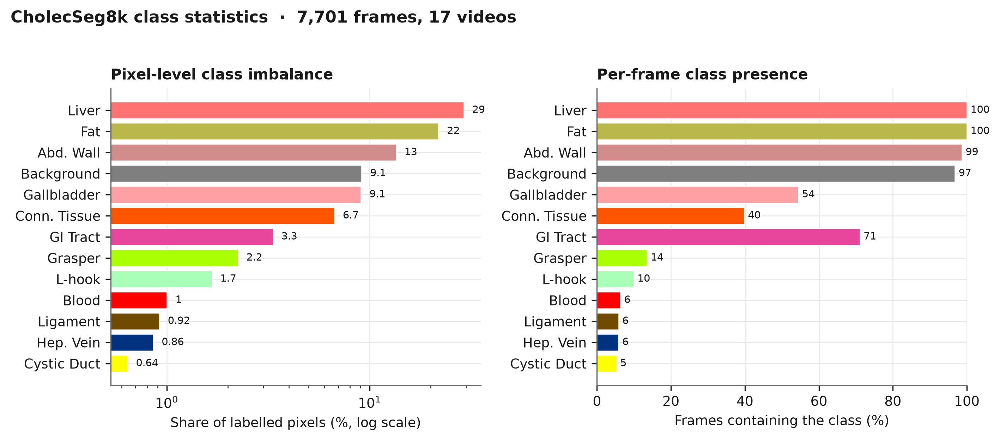
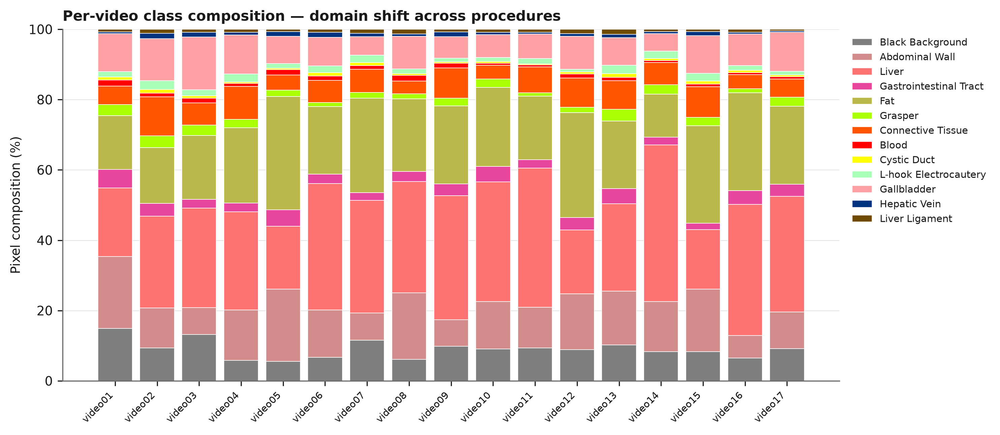

# EoWorld

**Encoder-Only Segmentation Queries as Latent State for Real-Time Surgical World Models**

Research code for the EoWorld proposal (IEEE TMI special issue). This repository
builds on [**tue-mps/eomt**](https://github.com/tue-mps/eomt) (the Encoder-only
Mask Transformer) and targets the [**CholecSeg8k**](https://www.kaggle.com/datasets/newslab/cholecseg8k)
laparoscopic-cholecystectomy dataset.

There are **two perception pipelines**, matching the proposal (§4.1) — image-level
(EoMT) and temporal (VidEoMT):

| Proposal item | What's here |
|---|---|
| Download & standardise CholecSeg8k | `eoworld/data/`, `scripts/01–02` |
| Dataset understanding + **journal-ready figures** | `eoworld/viz/`, `scripts/03` |
| **Image** perception — EoMT fine-tuning (Exp. 8.1) | `configs/cholecseg8k/semantic/`, `scripts/05` |
| **Query-token extraction** (the world-model state z_t) | `eoworld/query_tokens/`, `scripts/06` |
| **Video** perception — VidEoMT (temporal, VSS) | `eoworld/video/`, `configs/cholecseg8k/video_vss/`, `scripts/video/` |
| Quick setup / smoke gate before the full run | `scripts/00`, `scripts/04` |

👉 **Exact commands, expected output, and per-step troubleshooting for BOTH
pipelines:** [`docs/RUNNING.md`](docs/RUNNING.md).

The latent-dynamics model (Exp. 8.2), planning head (8.3) and uncertainty head
(8.4) build directly on the extracted query-token sequences — see
[`docs/ROADMAP.md`](docs/ROADMAP.md).

> Neither EoMT nor VidEoMT is vendored here. `scripts/00_setup.sh` clones EoMT to
> `third_party/eomt`; `scripts/video/00_setup_videomt.sh` clones VidEoMT to
> `third_party/videomt`. Our data modules, configs and tools plug into them
> without modifying upstream.
>
> ⚠️ The two use **incompatible stacks** (EoMT = PyTorch Lightning, VidEoMT =
> Detectron2), so each needs its **own conda env** (`eoworld` and `videomt`).
> `docs/RUNNING.md` spells this out.

---

## Preview: the dataset figures (synthetic-stats preview)

Generated by `scripts/03_visualize_dataset.py --demo` (real data replaces the
synthetic stats). All figures reuse the official CholecSeg8k class palette so a
class has one colour everywhere, and are written as 300-dpi PNG **+ vector PDF**.




More: `fig_palette_card`, `fig_cooccurrence`, `fig_frames_per_video`,
`fig_instrument_timeline`, and a real-data-only qualitative `fig_sample_grid`.

---

## Target environment

Built for a **local CUDA + Anaconda** setup on a **single RTX 5090 (32 GB)**.

```bash
conda create -n eoworld python=3.11 -y
conda activate eoworld
# The 5090 (Blackwell / sm_120) needs a recent CUDA build of PyTorch — check
# https://pytorch.org for the current command, e.g.:
pip install torch torchvision --index-url https://download.pytorch.org/whl/cu124
```

## Run it part by part

```bash
# 0. Clone EoMT + install deps into the active conda env
bash scripts/00_setup.sh

# 1. Get the data (needs a Kaggle API token; or download manually)
python scripts/01_download_data.py                  # prints the dataset root

# 2. Verify the watershed→class encoding on YOUR copy of the data
python scripts/02_inspect_masks.py --data-path <root>

# 3. Journal-ready dataset figures  (→ figures/)
python scripts/03_visualize_dataset.py --data-path <root>

# 4. Quick smoke gate — "is all the code okay?" before a full run
python scripts/04_quick_smoke_test.py --data-path <root>            # fast checks
python scripts/04_quick_smoke_test.py --data-path <root> --run-fit  # + 2-step fit

# 5. Get pretrained weights, then fine-tune EoMT on CholecSeg8k
python scripts/download_checkpoints.py --which small base large
bash scripts/05_train_segmentation.sh \
  configs/cholecseg8k/semantic/eomt_small_640_dinov2.yaml <root> \
  checkpoints/coco_panoptic_eomt_small_640_2x/pytorch_model.bin

# 6. Extract query-token states (z_t) from the fine-tuned model
python scripts/06_extract_query_tokens.py \
  --config configs/cholecseg8k/semantic/eomt_small_640_dinov2.yaml \
  --ckpt runs/<run>/checkpoints/last.ckpt --data-path <root> \
  --out cache/query_tokens_small
```

## Video pipeline (VidEoMT) — separate `videomt` env

```bash
conda create -n videomt python=3.12.3 -y && conda activate videomt
pip install torch==2.7.0 torchvision==0.22.0 --index-url https://download.pytorch.org/whl/cu126
bash scripts/video/00_setup_videomt.sh                       # clone VidEoMT + detectron2
export DETECTRON2_DATASETS=$HOME/datasets
python scripts/video/10_convert_cholecseg8k_to_vspw.py \
  --data-path <root> --out $DETECTRON2_DATASETS/CholecSeg8k_VSPW   # → VSPW format
python scripts/video/download_videomt_checkpoints.py --which vspw_segmenter
python scripts/video/train_videomt.py --num-gpus 1 \
  --config-file configs/cholecseg8k/video_vss/videomt_vitl_cholecseg8k.yaml \
  MODEL.WEIGHTS checkpoints/videomt/vspw_segmenter.pth
```

Full details incl. evaluation/mIoU and troubleshooting: [`docs/RUNNING.md`](docs/RUNNING.md).

## Backbones & checkpoints

Configs are provided for **EoMT-S / -B / -L**. The **DINOv2** configs are the
recommended default — their weights are **ungated**. The **DINOv3** config is
provided too but its weights are distributed as *deltas* requiring separate gated
access to Meta's DINOv3 (proposal §4.1.1 / §13). See
[`docs/CHECKPOINTS.md`](docs/CHECKPOINTS.md).

| Config | Backbone | Input | Suggested for |
|---|---|---|---|
| `eomt_small_640_dinov2.yaml` | ViT-S/DINOv2 | 640² | runtime feasibility (8.5), smoke test |
| `eomt_base_640_dinov2.yaml`  | ViT-B/DINOv2 | 640² | fast-track default (11.1) |
| `eomt_large_640_dinov2.yaml` | ViT-L/DINOv2 | 640² | accuracy / full-scope (11.2) |
| `eomt_large_640_dinov3.yaml` | ViT-L/DINOv3 | 640² | optional, **gated** |

## Layout

See [`docs/PROJECT_STRUCTURE.md`](docs/PROJECT_STRUCTURE.md) for a full tour.

```
eoworld/          data module, class table, figures, query-token extractor
configs/          EoMT configs for CholecSeg8k (S/B/L, DINOv2/DINOv3)
scripts/          00_setup … 06_extract, ordered to run part by part
docs/             CHECKPOINTS, PROJECT_STRUCTURE, ROADMAP
assets/preview/   committed example figures
third_party/eomt/ upstream EoMT (cloned by setup, git-ignored)
```

## Credits

Built on [EoMT](https://github.com/tue-mps/eomt) (Kerssies et al., CVPR 2025,
MIT License). Dataset: [CholecSeg8k](https://www.kaggle.com/datasets/newslab/cholecseg8k)
(Hong et al., 2020).
